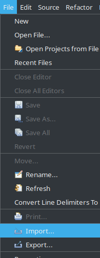
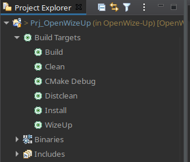
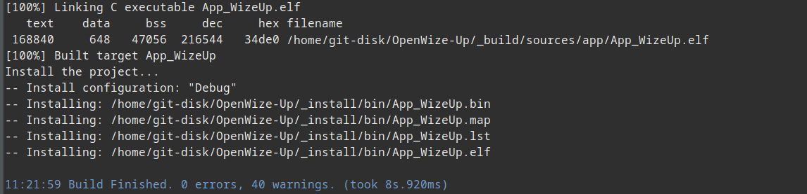

.. ****************************************************************************

Help on IDE
===========

.. _Import OpenWize-Up project:

Import the OpenWize'Up project
------------------------------

In the menu bar, select '*File*', '*Import...*'

   Import a Project

Then, in section "General", select '*Existing Projects into Workspace*'

   Select "Import Existing Project into the Workspace"
   
'*Next >*', '*Browse...*' into folders to find the OpenWize-Up directory. 

   Browse the your file system
   
Finally, click on '*Finish*'

.. ****************************************************************************
.. _Build the OpenWize-Up:

Build the OpenWize'Up
---------------------

.. warning:: 
   **Prerequitsite** : The OpenWize'Up Project has already been imported (see :ref:`Import OpenWize-Up project`).

On left panel, in "*Project Explorer*" several "*Build Targets*" are provided :

   Available *Build Targets*

- WizeUp : Setup the Wize'Up board.
- CMake Debug : Launch the cmake with '*-DCMAKE_BUILD_TYPE=Debug*' option.
- CMake Release : Launch the cmake with '*-DCMAKE_BUILD_TYPE=Release*' option.
- Build : Build the application
- Clean : Clean the previous build
- Distclean : Remove all build and install content 
- Install : Install the binary files.

.. note:: 
   Before using one of "*Build Targets*" execute the '*WizeUp*' target.
   The '*WizeUp*' target must be executed at least the first time.

The build workflow is the following :

#. Double-click on '*WizeUp*' target, then on the IDE console you should see : 

   Result from '*WizeUp*' target

#. Next, generate the build system by double-click on '*CMake Debug*' target. 
   The console gives you the generation prcess result : 

   Result from '*CMake Debug*' target
   
#. Then, double-click on '*Build*' target to build the application. After few 
   seconds the compilation and link stages are finished. In the console you should
   be able to see something like the following : 

   Result from '*Build*' target 

#. Finally, install thes binaries files. The goal here, is mainly to be able to 
   get the executable file to debug or run it. Double-click on '*Install*' target
   and check in '*Project Explorer*' panal that files are available (refresh 
   with F5 if required). 

   Result from '*Install*' target 

.. ****************************************************************************
.. _Create a Debug Configuration:

Create a Debug Configuration
----------------------------

.. warning:: 
   **Prerequitsite** : The OpenWize'Up Project has already been imported (see :ref:`Import OpenWize-Up project`).

- Ensure that active "Build Configuration" is set to "Debug"

   .. figure:: ../pics/IDE_BuildConfiguration.png
      :width: 65 %
      :align: center

      Set the debug build configuration active

- In menu bar, select '*Run*', '*Debug Configurations...*'.
- On the left panel, right-click on "STM32 Cortex-M C/C++ Application", then "New Configuration".
- Give it the name : "OpenWize-Up Debug" 
- On the center panel : 
   - On the "Main" tab :
      In the section "Project:", "Browse..." and select "Prj_OpenWizeUp". 
      Ensure that "App_WizeUp.elf" is found in section "C/C++ Application:"

      .. figure:: ../pics/IDE_DebugConfiguration_1.png
         :width: 90 %
         :align: center
      
         Debug Configuration "Main" tab      
       

   - On the "Debugger" tab : 
      Select your probe and, if required, set the "Device" to "STM32L454CE"
      
      .. figure:: ../pics/IDE_DebugConfiguration_2.png
         :width: 90 %
         :align: center
      
         Debug Configuration "Debugger" tab.       
   
   
   Then Apply and Debug. After few second you should be able see the opened debugging session  :

   .. figure:: ../pics/IDE_DebugView.png
      :width: 90 %
      :align: center
   
      Opened debug session

      