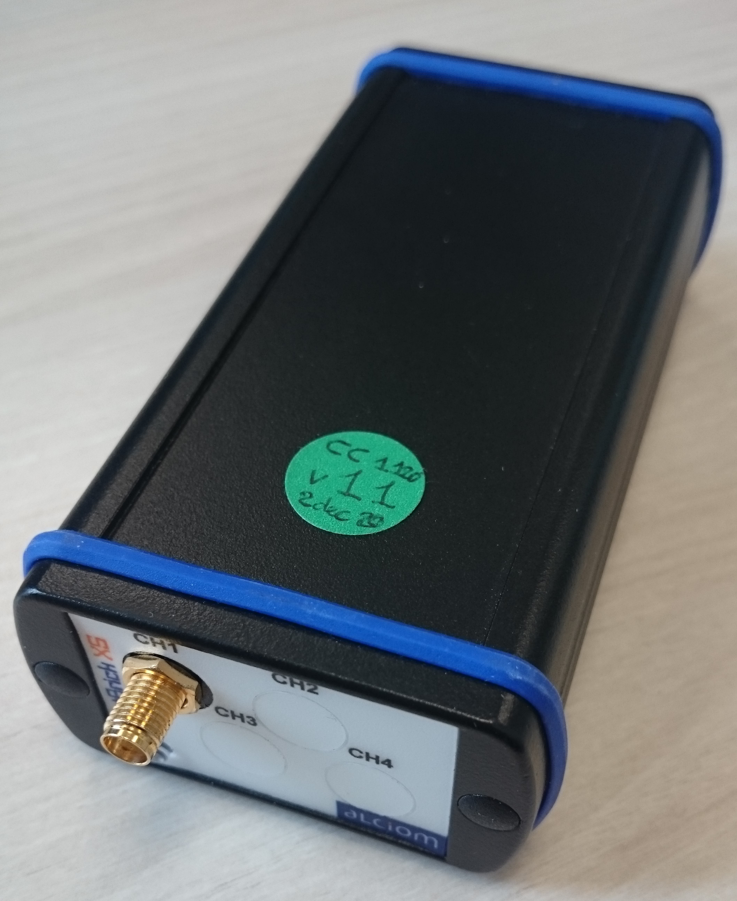

.. ****************************************************************************

.. _Test tools:

Test tools
==========

The SmartBricks or TRX is a transciver developed by `Alciom`_. It works on the 169 Mhz bandwith and drived over USB. 

   The SmartBricks transciver

A software tool is available at `this page <https://github.com/WizeEveryWhere/banc_lib.git>`_. 

.. *****************************************************************************
.. references

.. _`Alciom` : https://www.alciom.com/en/home
