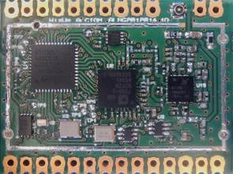

.. *****************************************************************************

*******
Welcome
*******

The OpenWize'Up is the name of an application targeting the Wize'Up board. 
This last is very tiny and can be soldered or plugged as a piggyback-board.

  
   The Wize'up board
 
Wize'Up is an "Open Hardware", designed and made by the Alciom company (`Alciom`_). All the details and documentation can be found on the `Wize’Up`_ website page.
Wize'Up is delivered with its base board allowing you to quickly start your project.

.. figure:: pics/wize-up_base-board.png
   :align: center

   The Wize'Up connected to its base board

Wize'Up integrates an STM32L451 MCU with 512kB of Flash memory and 128kB of RAM. 
The RF part is dedicated to the ADF7030-1 transceiver IC from Analog Device.

OpenWize'Up is based on OpenWize, an implementation of the Wize IoT protocol dedicated to the exploitation of the 169 MHz frequency band. 
The local communication is provided by an AT command  (`Wize'Up AT Specification`_) on a UART peripheral. 

.. *****************************************************************************
.. references

.. _`OpenWize Documentation`: https://github.com/GRDF/OpenWize/blob/main/docs/OpenWize.rst
.. _`Wize Lan Protocol Specifications`: https://www.wize-alliance.com/Downloads/Technical

.. _`STM32CubeIDE`: https://www.st.com/en/development-tools/stm32cubeide.html#get-software
.. _`Cmake`: https://cmake.org
.. _`Git`: https://git-scm.com
.. _`Make`: https://www.gnu.org/software/make
.. _`Alciom` : https://www.alciom.com/en/home
.. _`Wize’Up`: https://www.alciom.com/en/our-trades/products/wizeup
.. _`Wize'Up AT Specification`: https://www.alciom.com/wp-content/uploads/2021/05/RL2031-008-wizeup-AT-command-specification-1E.pdf 
