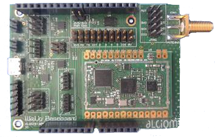

*******
Welcome
*******

The OpenWize'Up is the name of an application targetting the Wize'Up board. 
This last is very tiny and can be soldered or plugged as a piggyback-board.

.. figure:: pics/wize-up_board.png
   :align: center
  
   The Wize'up board
 
Wize'Up is an "Open Hardware", designed and made by the Alciom compagny (`Alciom`_). All the details and documentation can be found at `Wize’Up`_ website page.  
Wize'Up comes with its base board allowing to quickly getting started of your project.

   The Wize'Up plugged to its base board

Wize'Up integrate an STM32L451 MCU with 512kB of Flash memory and 128kB of RAM. 
The RF part is dedicated to the Analog Device ADF7030-1 transciver IC.

The OpenWize'Up rely on OpenWize, an implementation of the Wize IoT protocol dedicated to exploit the 169 Mhz frequency band. 
The local communication is ensure by AT Command (`Wize'Up AT Specification`_) over an UART peripheral. 

.. *****************************************************************************
.. references

.. _`OpenWize Documentation`: https://github.com/GRDF/OpenWize/blob/main/docs/OpenWize.rst
.. _`Wize Lan Protocol Specifications`: https://www.wize-alliance.com/Downloads/Technical

.. _`STM32CubeIDE`: https://www.st.com/en/development-tools/stm32cubeide.html#get-software
.. _`Cmake`: https://cmake.org
.. _`Git`: https://git-scm.com
.. _`Make`: https://www.gnu.org/software/make
.. _`Alciom` : https://www.alciom.com/en/home
.. _`Wize’Up`: https://www.alciom.com/en/our-trades/products/wizeup
.. _`Wize'Up AT Specification`: https://www.alciom.com/wp-content/uploads/2021/05/RL2031-008-wizeup-AT-command-specification-1E.pdf 
